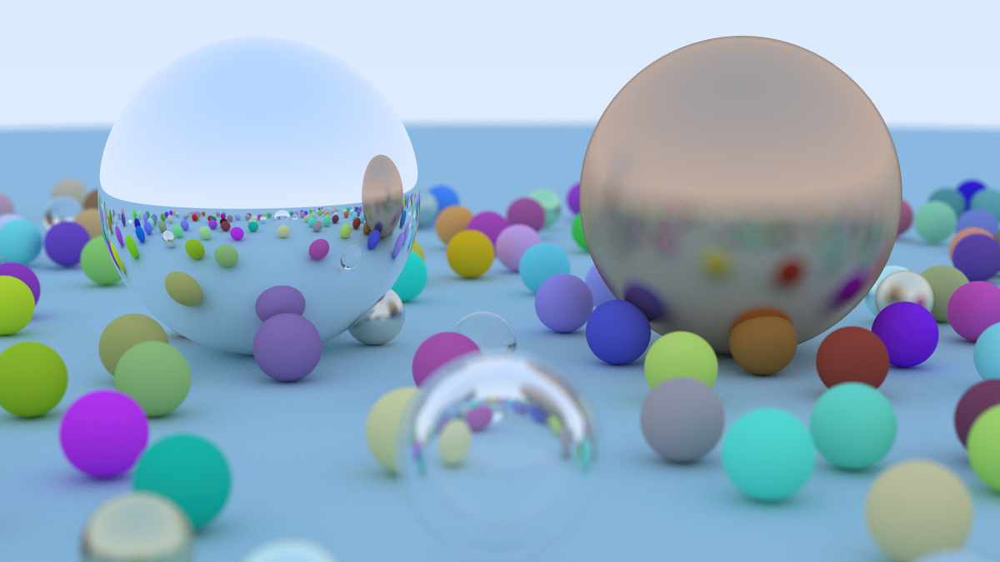

# Raytracing Render with Spheres

This project is a rendering program that uses **ray tracing** to generate 3D images of spheres. It leverages the geometric simplicity of spheres for efficient and accurate calculations. The **SDL2** library is used for real-time visualization, and there is an option to export the result as a PNG file.

## Purpose

The purpose of this project is purely educational and personal. It serves as a demonstration of my skills in **Object-Oriented Programming (OOP)**, **optimization in C++**, and the application of **best practices** in software development. It is not intended for professional use but as a showcase of my ability to design and implement a complex system using modern C++ techniques.

## What is Ray Tracing?

**Ray tracing** is a rendering technique that simulates the behavior of light in a virtual environment to produce highly realistic images. Each pixel in the image is calculated by tracing a ray from the camera through the scene, determining how it interacts with objects by reflecting, refracting, or being absorbed. This allows for effects such as reflections, refractions, and shadows with a high level of detail.

## Key Features

- Sphere rendering using ray tracing.
- Real-time visualization with **SDL2**.
- Image export to PNG format.
- Support for reflection, refraction, antialiasing, and a diffusion filter in the camera.

## Installation and Compilation

To compile and run this project, follow these steps:

1. **Install SDL2**:
   - On Linux:
     ```bash
     sudo apt-get install libsdl2-dev
     
     sudo apt install libsdl2-image-dev
     ```
   - On Windows, you can install SDL2 and configure the library paths in the `Makefile` accordingly. Ensure the paths to SDL2's `include` and `lib` directories are correctly set.

2. **Compile the project**:
   - Use the following command from the project's root directory:
     ```bash
     make
     ```

3. **Run the program**:
   - After compiling, you can run the generated executable with:
     ```bash
     make run
     ```
   - An image of the render can be generated by adding this option:
     ```bash
     make run IMAGE=render_name
     ```

4. **Clean the build artifacts**:
   - To clean up the compiled files, use:
     ```bash
     make clean
     ```

## Results

Below is an example of a render generated by the program. These image include effects of:

- **Reflection**: Simulation of reflective surfaces like mirrors.
- **Refraction**: Simulation of light passing through transparent materials.
- **Antialiasing**: Smoothing of edges to reduce the jagged effect.
- **Diffusion Filter**: Simulation of camera blur for a more realistic effect.



## Possible Improvements

- **Parallelization**: Implement CUDA to parallelize the calculation of each pixel, utilizing GPU power.
- **Camera Control**: Add interactive camera controls to allow different perspectives.
- **Intersection Optimization**: Improve the calculation of intersections between spheres and rays to increase efficiency.
- **Complex Figures**: Extend support to include other, more complex geometric figures.

## Contributions

Contributions are welcome. Feel free to open an **issue** or a **pull request** to discuss potential changes.

---

This project is a formative endeavor, intended to demonstrate my abilities in C++ programming, specifically in OOP, optimization, and adherence to best programming practices.
